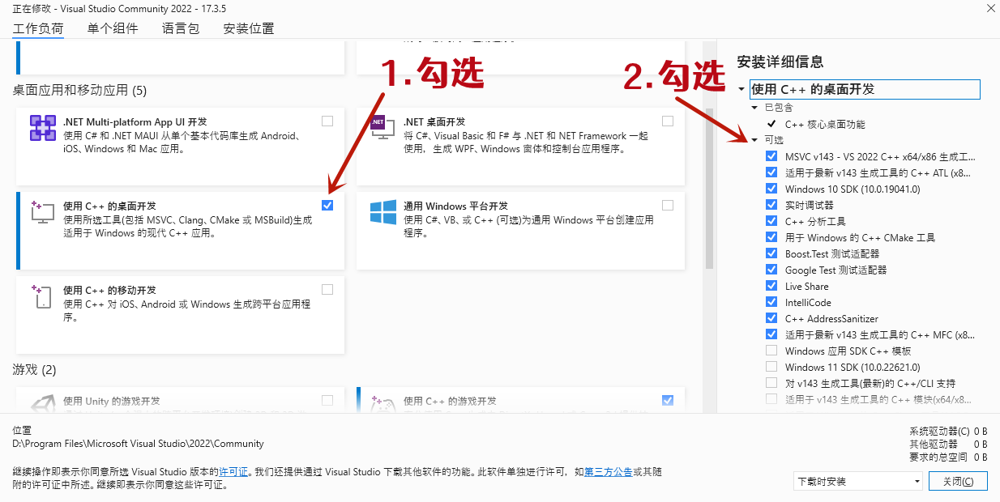
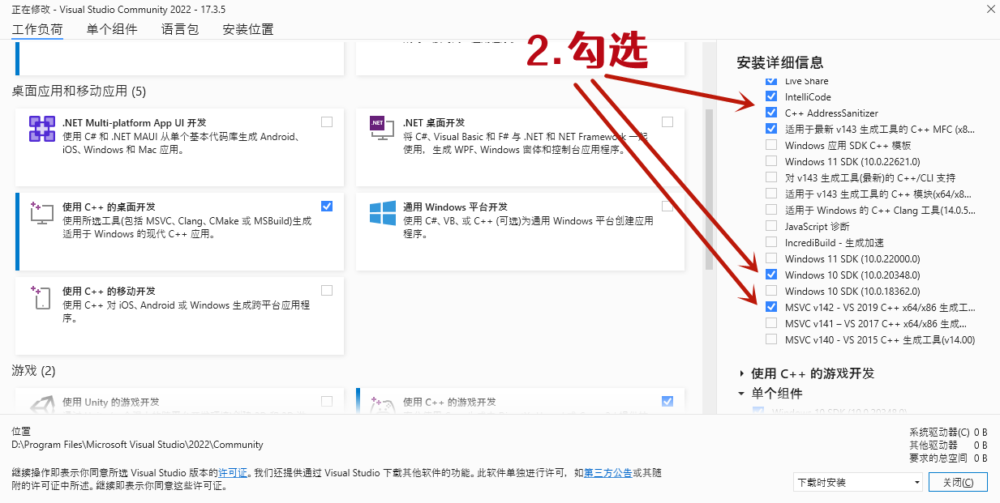
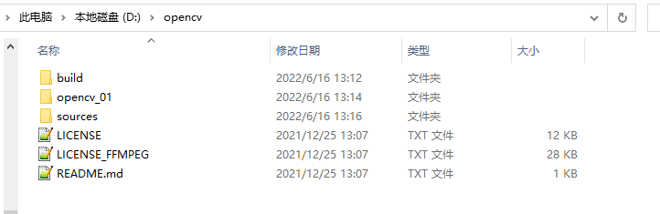

简体中文 | [English](README_en.md)

# miemienet

## 概述
自2019年初咩酱从java转行python，经过4年知识沉淀，咩酱终于在2022年11月有了自己的深度学习推理引擎！miemienet是[咩酱](https://github.com/miemie2013) 个人自研的深度学习推理引擎，使用C++11标准，其有如下特性：

- miemienet计算部分无任何第三方依赖，简单纯粹；miemienet用于目标检测等图像任务的部署时，仅依赖opencv处理图片。 miemienet会始终保持第三方依赖少、使用简单等特性，提供给用户友好的用户体验。
- miemienet目前支持x86架构的cpu推理，预计未来会加入支持arm、vulkan、opengl等更多计算后端；
- miemienet支持windows、linux多种操作系统；
- miemienet使用纯C++代码组网，而不是使用文本文件。miemienet组网方式非常像pytorch、paddlepaddle。优点是你可以在前向传播的任何地方打断点调试C++代码，你不用将深度学习推理框架视为黑盒，你可以学习它了解它甚至扩展它，让它支持更多的算子，缺点是你需要手写C++代码组网（如果这也算缺点的话）。

咩酱使用miemienet实现了PPYOLOE、PICODET等算法(作为miemienet的使用示例)，如果你想学习使用miemienet，翻阅它们的代码是一个不错的选择。这么棒的仓库，请大家点个star吧！

## 环境搭建

### Windows

1.首先，安装Visual Studio 2022 社区版，安装时，勾选“使用C++的桌面开发”，并在右边“安装详细信息”的“可选”部分勾选需要的部分，如下图所示：（如果图片加载太慢或者加载不出来，直接下载miemienet仓库并解压，进入docs/images/文件夹查看图片）





之后等待安装完成即可。

2.安装opencv，这里建议使用我的编译好的opencv，链接：https://pan.baidu.com/s/1_eevGRb7pmNbg86NzF2O1A 
提取码：rcos

下载opencv.zip，把opencv.zip放在D盘根目录下，解压到当前目录，进入解压后得到的opencv文件夹，你将看到这些：



3.下载miemienet的代码并解压（或者克隆仓库到本地），用Visual Studio打开解决方案文件miemienet.sln。如果按下Ctrl+F5，你将运行一个目标检测的示例，main()函数位于test/test_objectdet.cpp。但是现在还没有模型文件，需要先转换模型文件：

下载下面这2个模型文件，这是PaddleDetection官方提供的模型文件：
```
https://paddledet.bj.bcebos.com/models/ppyoloe_crn_s_300e_coco.pdparams
https://paddledet.bj.bcebos.com/models/picodet_s_416_coco_lcnet.pdparams
```

下载后把它们放在miemienet的test文件夹下。打开一个终端(cmd)进入miemienet的test文件夹，输入命令：

```
python convert_ppdet_tools.py --model_path ppyoloe_crn_s_300e_coco.pdparams
python convert_ppdet_tools.py --model_path picodet_s_416_coco_lcnet.pdparams
```

你将会在miemienet的test/save_data文件夹下看到picodet_s_416_coco_lcnet.bin、picodet_s_416_coco_lcnet.mie、ppyoloe_crn_s_300e_coco.bin、ppyoloe_crn_s_300e_coco.mie 这4个文件，这是miemienet能识别的模型文件。

回到Visual Studio，按下Ctrl+F5，即可执行目标检测示例程序。

如果你需要对比PaddleDetection下的相同模型预测同一张图片，在PaddleDetection根目录下运行：
```
python tools/infer.py -c configs/ppyoloe/ppyoloe_crn_s_300e_coco.yml -o weights=https://paddledet.bj.bcebos.com/models/ppyoloe_crn_s_300e_coco.pdparams --infer_img demo/000000014439.jpg --draw_threshold 0.5

python tools/infer.py -c configs/picodet/picodet_s_416_coco_lcnet.yml -o weights=https://paddledet.bj.bcebos.com/models/picodet_s_416_coco_lcnet.pdparams --infer_img demo/000000014439.jpg --draw_threshold 0.5

```
即可。

### Ubuntu


## Updates!!
* 【2022/11/03】 miemienet首次公开。


## 友情链接

- [miemieGAN](https://github.com/miemie2013/miemieGAN) miemieGAN是咩酱个人开发与维护的图像生成库，以咩酱的名字命名，实现了stylegan2ada等算法，目前文档完善中，欢迎大家试玩。


## 传送门

算法1群：645796480（人已满） 

算法2群：894642886 

粉丝群：704991252

关于仓库的疑问尽量在Issues上提，避免重复解答。

B站不定时女装: [_糖蜜](https://space.bilibili.com/646843384)

知乎不定时谢邀、写文章: [咩咩2013](https://www.zhihu.com/people/mie-mie-2013)

西瓜视频: [咩咩2013](https://www.ixigua.com/home/2088721227199148/?list_entrance=search)

微信：wer186259

本人微信公众号：miemie_2013

技术博客：https://blog.csdn.net/qq_27311165

AIStudio主页：[asasasaaawws](https://aistudio.baidu.com/aistudio/personalcenter/thirdview/165135)

欢迎在GitHub或上面的平台关注我（求粉）~


## 打赏

如果你觉得这个仓库对你很有帮助，可以给我打钱↓


咩酱爱你哟！


## 引用

miemienet借鉴了下面仓库的优秀代码：

[Paddle](https://github.com/PaddlePaddle/Paddle)

[ncnn](https://github.com/Tencent/ncnn)

[PaddleDetection](https://github.com/PaddlePaddle/PaddleDetection)

[YOLOX](https://github.com/Megvii-BaseDetection/YOLOX)

[miemiedetection](https://github.com/miemie2013/miemiedetection)


